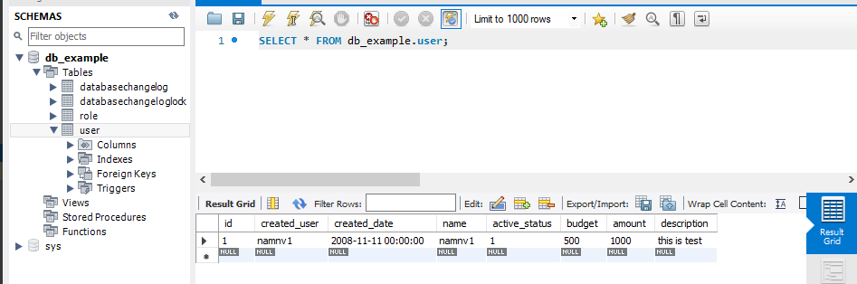

# Install mysql workbench # 

config database table on `changelog-master.xml` 

if the table exist before, you must clear data of `databasechangelog` and drop that table
(if not, you will meet checksums error)

If you have domain folder (@Entity), to restrict duplicate please set `ddl-auto: none`
(because if `ddl-auto: create` the annotation @Entity will create table if it is not exist)

## How to generate liquibase file automatically ##
### conditional: table must exist on database ###

- add plugin to `pom.xml`

- run on terminal
  
    `mvn liquibase:generateChangeLog`
  
output: `src/main/resources/autoGenerate/liquibase-outputChangeLog.xml`

Now can copy and paste to small xml file